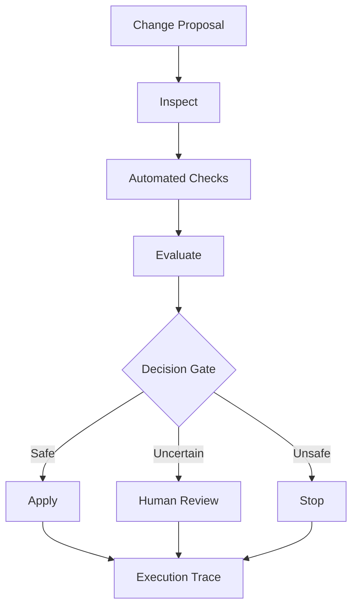

# ChangeGate

A confidence aware decision gate for autonomous software changes. It evaluates a proposed change and routes it to automatic application, human review, or stop.

## Demo

Production URL: https://change-gate.vercel.app

The web interface displays:
- **Change Under Review**: Proposal metadata, touched files, and unified git diff.
- **Workflow Traversal**: Graph visualization highlighting the active path through the pipeline.
- **Decision**: Final gate routing (`Apply`, `Review Required`, or `Stopped`) with rationale.
- **Execution Trace**: Chronological audit log showing node latencies and execution steps.

## What it does

Autonomous coding systems can make changes successfully from a technical perspective while still making the wrong decision about whether a change should be applied automatically.

ChangeGate separates workflow execution from the decision gate and routes changes to:
- **Apply**: Safe changes meeting all automated checks and confidence thresholds, applied automatically.
- **Review**: High-risk, ambiguous, or architectural changes requiring human engineering sign-off.
- **Stop**: Changes causing test failures or violating safety policies, halted immediately.

## How it works

ChangeGate runs an explicit LangGraph flow:

```text
inspect -> checks -> evaluate -> apply / review / stop
```

LangGraph controls explicit workflow traversal, and the decision provider supplies the bounded evaluation used by the gate:
1. `inspect`: Inspects change metadata, touched paths, and change type.
2. `checks`: Executes automated verifications (syntax, test suite, static checks).
3. `evaluate`: Evaluates safety, policy compliance, and risk to determine the routing outcome.
4. `apply` / `review` / `stop`: Terminal nodes reached according to the gate's decision.

The system is not an autonomous agent or chatbot; it is a deterministic workflow with a bounded decision step. Execution events are streamed to the client in real time via Server-Sent Events (SSE).

## Architecture



## Scenarios

The repository includes five predefined test proposals exercising each gate route:

| Proposal | Description | Expected Decision | Terminal Node |
|---|---|---|---|
| **CHANGE-001** | Safe Docstring & Type Annotation Fix | `Apply` | `apply` |
| **CHANGE-002** | Patch Dependency Bump (`httpx`) | `Apply` | `apply` |
| **CHANGE-003** | Database Column Deprecation | `Review Required` | `review` |
| **CHANGE-004** | Refactoring with Broken Tests | `Stopped` | `stop` |
| **CHANGE-005** | Unsanitized Security Auth Bypass | `Stopped` | `stop` |

## Local Development

### Prerequisites
- Python 3.11+
- Node.js 18+

### Backend Setup
```bash
cd backend
python -m venv .venv
source .venv/bin/activate  # On Windows: .venv\Scripts\activate
pip install -r requirements.txt
uvicorn app.main:app --port 8003
```

### Frontend Setup
```bash
cd frontend
npm install
npm run dev
```

The frontend dev server runs at `http://localhost:5176` and proxies `/api` to `http://localhost:8003`.

### Tests
```bash
cd backend
pytest
```

## Deployment

- **Frontend**: Hosted on Vercel (`frontend/` root directory, single-page application fallback).
- **Backend**: Hosted on Render (`backend/` web service running Uvicorn).
- Real-time updates use HTTP Server-Sent Events (`/api/evaluate/stream`).

## Providers

Configured via the `JEV_PROVIDER` environment variable:
- `mock` (default): Deterministic local evaluator with no external dependencies.
- `typesafe`: TypeSafe AI Jev API (`https://api.typesafe.ai/v1/systemone`). Requires `TYPESAFE_API_KEY`.
- `jev_agent`: Relay service (`https://jev-agent.com/api/v1/systemone`). Requires `JEV_AGENT_KEY`.
